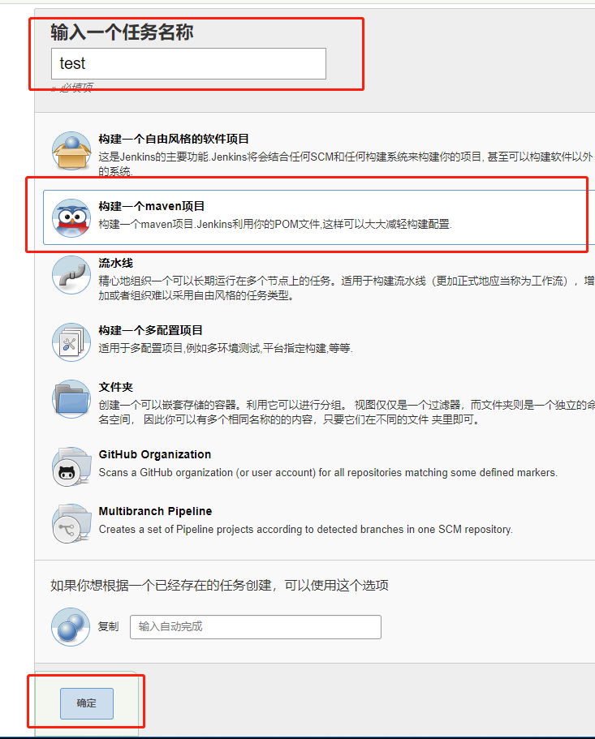
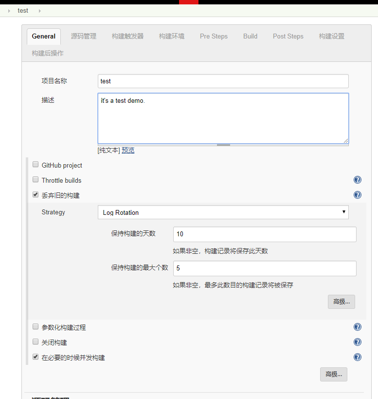
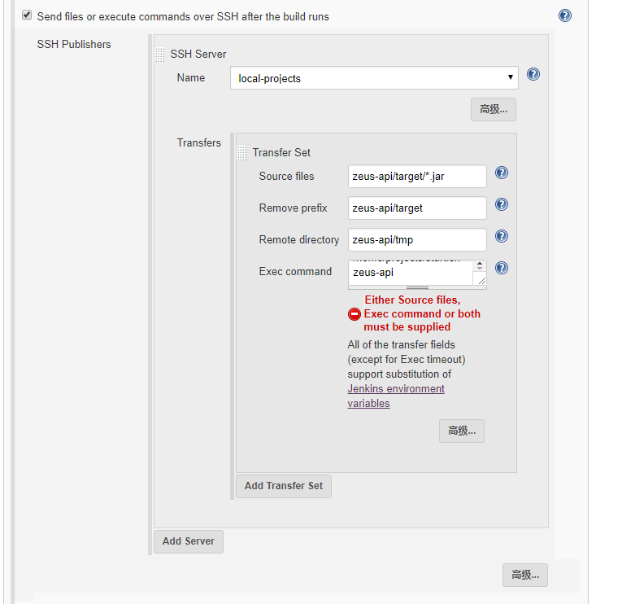
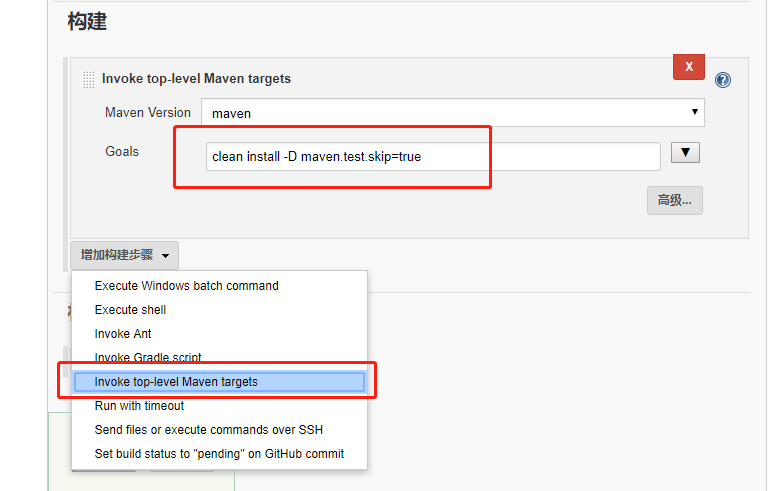
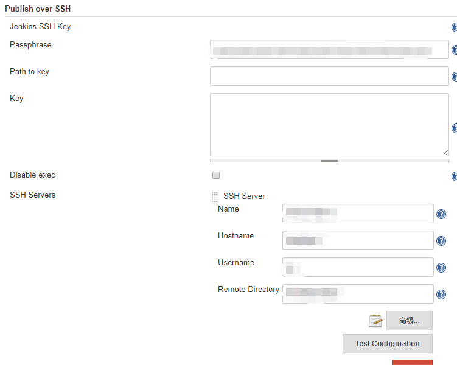

# Jenkins + Sprint boot

## TOC

### 新建Job
* `点击新建任务进入创建Job选项`
  
* 点击创建Maven项目,填写任务名,点击确认进入下一步设置
  

### 项目设置
* Genneral
  
* 源码管理, 按照项目配置填写
* 构建环境
  * 选择`Send files or execute commands over SSH after the build runs`
  
  * <details><summary>introduce</summary>

    名称|内容|说明
    :----:|:----:|:----:
    Name| 需要部署的服务器配置 | 需要安装 `Publish Over SSH`插件
    Souorce file | 安装包 | maven 打包后的包
    Remove Prefix | ~~移除前缀~~ | 略
    Remote directory | 远程地址 | 即所部署服务器预留地址<sup>[^Publish Over SSH](#powerbyoverssh)</sup>
    Exec command | `bash -x [remote/shell]`<sup>[^shell](#shell)</sup> | 部署任务结束后执行的任务<sup>[^shellcommand](#shellcommand)</sup>
</details>

* 构建任务
  * 选择 `invoke top-level Maven targets`
  * Goals
    ```shell
    clean install -D maven.test.skip=true
    ```
  * 
  
### 需要安装的插件
 * Publish Over SSH
 * Maven Integration plugin
 * Git

### 服务器环境
 * <details><summary>JDK</summary>
 
   * 选择手动安装
  </details>

 * <details><summary>Maven</summary>
   
   * 选择手动安装
</details>
   
 * Git 


## DOC

### <p id = "powerbyoverssh">[Publish Over SSH:](https://wiki.jenkins.io/display/JENKINS/Publish+Over+SSH+Plugin)</p> 

 先配置好 `Publish Over SSH` 插件
* `系统管理`->`管理插件`->`可选插件`->`搜索Publish Over SSH`->`安装并重启Jenkins`
* `系统管理`->`系统设置`->`Publish over SSH`
  * 
  
  * <details><summary>introduce</summary>
 
    名称|内容|说明
    :----:|:----:|:----:
    PassPhrase | *** | 部署服务器分配的用户密码
    Name | tag | 部署服务器别名
    Hostname | localhost | 主机地址，本机`localhost`
    Username | test | 部署服务器分配的用户名
    Remote Directory | ~~/home/test~~ | 服务器内部署位置
</details>

### <p id = "shell">Shell:</p>
<details><summary>脚本</summary>

> **`请赋予脚本写入权限u+x`**

```shell
#!/bin/bash -ilex

# Jenkins环境内使用服务器环境
export JAVA_HOME=/usr/local/java
export PATH=$JAVA_HOME/bin:$PATH
export CLASSPATH=.:$JAVA_HOME/lib/dt.jar:$JAVA_HOME/lib/tools.jar

# 查询端口占用情况
pidinfo=`sudo netstat -tunlp | grep $1 | awk '{print $7}'`
echo $pidindo
index="/"
pid=${pidinfo%$index*}
echo "it will be kill the pid with $pid"
if [ ! -z $pid ];then
 sudo kill -9 $pid
fi
# 运行sprint boot项目
tmp="$2/tmp/$2.jar"

if [ -f $tmp ];then
 echo "start service with $tmp"

 log="$2/$2.log"
# if [ ! -f $log ];then
#  sudo touch $log
#  sudo chmod 777 $log
# fi

 nohup java -jar "$tmp" > $log 2>&1 &
fi

```
</details>


### <p id = "shellcommand">Shell Command:</p>
```shell
BUILD_ID=DONTKILLME
cd /home/projects  /~~wallet~~
# remote/shell shell 所在部署服务器的地址
# port application port
# Remote directory jar包所在部署服务器地址
bash -x [remote/shell] [port] [Remote directory parent]
```

<!-- </details> -->
